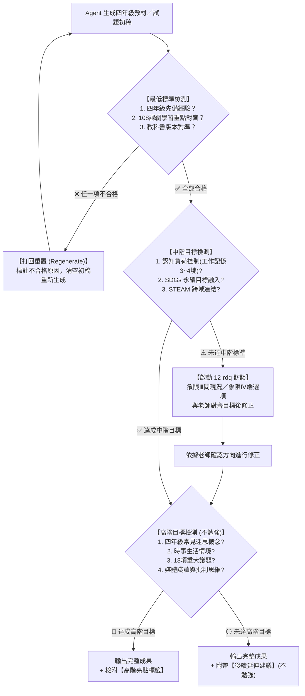

# 國小四年級教材與試題自我檢測審查機制 (G4-Review)

> **核心宗旨**：保障 AI 生成之國小四年級教材、試題、作業或學習單，具備真實教學現場之可用性、合規性與專業度。
> **處置準則**：
> 1. **未達最低標準** ➔ **立刻打回重置（自毀重產，禁止輸出半成品給教師）**。
> 2. **未達中階目標** ➔ **啟動 `12-rdq` 需求探索技能，向教師訪談確認取捨後再修正**。
> 3. **未達高階目標** ➔ **不勉強，列為加分延伸或亮點建議**。

---

## 核心基本設定與教師偏好

| 項目 | 預設規格與偏好 |
|---|---|
| **學校與年級** | 臺中市梧棲區中正國民小學（梧棲區中正國小）四年級 |
| **任教科目固定版本** | • **數學**：**南一版**<br>• **國語**：**翰林版**<br>• **社會**：**康軒版**<br>*(以上三科自動鎖定為預設版本，免每次重複詢問；其餘科目如自然、英語則依規查詢或確認)* |
| **中階未達標 RDQ 策略** | **極簡「一鍵選擇」模式（象限Ⅳ優先）**：<br>直接端出 2~3 個具體、立即可採納的教材/試題改造方案供老師快速勾選確認，嚴禁冗長發散詢問，將打擾降至最低。 |

---

## 審查流程漏斗圖（State Machine）



---

## 第一階：最低標準（Must-Have / 紅線門檻）

> **處置動作**：**若未達到任一指標，一律「打回重置（Regenerate）」，絕不將未達標內容呈現給教師。**

| 檢核維度 | 具體指標與評判基準 | 驗證方法與檢查點 |
|---|---|---|
| **1. 四年級先備經驗** | • 嚴格對準國小中年級（三下至四上／四下）認知發展階段（皮亞傑具體運思期轉型期）。<br>• **不可超綱**：嚴禁出現未學過之五、六年級概念（如尚未教過的未知數方程式 $x/y$、複雜小數乘除、柱體錐體體積公式等）。<br>• 語文難度：國字注音對齊教育部四年級常用字彙，無生僻罕用字；閱讀理解篇幅控制在 400~600 字內。 | 檢查概念是否為一至三年級已奠基、四年級正建構之內容。凡超綱概念立刻攔截。 |
| **2. 108 課綱學習重點** | • 試題或教材必須能清楚標註對應之 **學習表現** 代碼（如國語 `5-Ⅱ-1`、數學 `n-Ⅱ-7`、自然 `pe-Ⅱ-1`、社會 `1b-Ⅱ-1`）與 **學習內容** 代碼（如國語 `Ab-Ⅱ-1`、數學 `N-4-4`）。<br>• 核心素養導向：非死背死記，須包含生活情境脈絡化問題。 | 每道試題或教材單元，末端或後設資料必須具備精確的 108 課綱代碼對應。 |
| **3. 各科目教科書版本對準** | • 必須明確對準該科目在該學期選用之教材版本（翰林／康軒／南一等）之單元編排順序與專有名詞。<br>• **版本確認機制**：<br>  1. 優先查詢：**臺中市梧棲區中正國小教務處／設備組／教學組公告之最新學年度教科書評選結果**（參考 `references/ccps_textbook_guide.md`）。<br>  2. 主動詢問：若線上查無明確當期資料，Agent **必須主動詢問老師當前科目的使用版本**，嚴禁擅自通靈預設。 | 驗證單元名稱、用詞（如「假分數/帶分數」教學先後、「水的三態」實驗安排）是否吻合該版本進度。 |

---

## 第二階：中階目標（Should-Have / 盡力達到）

> **處置動作**：**若未達成本階任一指標，不可直接敷衍產出，必須立即啟動 `12-rdq` 技能進行訪談，向教師確認需求後再做修正。**

| 檢核維度 | 具體指標與評判基準 | 未達標時的 RDQ 訪談問句範例 |
|---|---|---|
| **1. 最新認知負荷理論 (CLT)** | • **工作記憶容量控制**：四年級學童工作記憶容量約 3~4 個資訊塊（chunks）。題目條件與題幹不可包含過多雜訊。<br>• **外在負荷最小化**：版面結構清晰、圖文相鄰（避免注意力分散效應 Split-Attention Effect）、無冗餘贅詞（避免冗贅效應 Redundancy Effect）。<br>• **相關負荷優化**：提供思考鷹架（如步驟指引、解題線索提示框、填空圖表）。 | **象限Ⅲ（問老師）**：「請問班上學生的閱讀與理解落差大嗎？題幹是否需要加上步驟化的鷹架提示？」<br>**象限Ⅳ（端菜單）**：「目前版面字數稍多，我提供『A. 精簡題幹並附思考指引框』或『B. 原文保留但加粗關鍵字』兩種排版，老師希望採用哪種？」 |
| **2. SDGs 永續發展目標** | • 將生活情境有機融入 17 項永續目標中的適合主題（如：SDG 3 良好健康、SDG 6 淨水、SDG 11 永續城鄉、SDG 12 責任消費、SDG 14 海洋生態、SDG 15 陸域生態）。<br>• 拒絕牽強附會：題目脈絡必須自然，而非生硬貼上標籤。 | **象限Ⅳ（端菜單）**：「本單元在數學統計圖表/國語閱讀中，建議可融入『SDG 12 減少校園午餐廚餘』或『SDG 14 梧棲港海洋塑膠廢棄物調查』作為題材，老師偏好哪一個？」 |
| **3. STEAM 跨域教學連結** | • 融入 Science（科學探究）、Technology（科技應用）、Engineering（動手機構/工程思維）、Art（視覺美感與表達）、Mathematics（數學分析）至少 2 種以上跨域元素。<br>• 具有動手實作、觀察驗證或跨學科綜合應用之設計。 | **象限Ⅲ（問老師）**：「這個單元是否有安排學生動手組裝（如積木/教具）或需要搭配平板電腦紀錄的環節？」<br>**象限Ⅳ（端菜單）**：「若加入 STEAM 元素，可設計『讓學生設計省水機關並計算水量』的加分挑戰題，是否需要為您加入？」 |

---

## 第三階：高階目標（Nice-to-Have / 若是不行不勉強）

> **處置動作**：**盡可能評估融入，但若單元性質不適合或過度負擔，則「不勉強」，僅在檢測報告中附帶延伸建議，不阻擋出題與輸出。**

| 檢核維度 | 具體指標與評估方向 | 實踐範例 |
|---|---|---|
| **1. 四年級常見迷思概念診斷** | 針對四年級經典認知迷思設計診斷性誘答選項（Diagnostic Distractors）：<br>• 數學：同分母分數相加「把分母也加起來」迷思；周長越長面積就越大迷思；角度長短看邊長迷思。<br>• 自然：以為水沸騰時看見的白煙是水蒸氣（應為小水滴）；以為植物根部吸水是在白天晚上沒有等。<br>• 社會：將「家鄉的界線」誤認為自然地理絕對不可變等。 | 在選擇題中設計具診斷價值的誘答選項，並在教師手冊中標註：「選 (B) 代表學生具有同分母相加連分母一併相加的典型迷思」。 |
| **2. 在地時事與生活情境** | 結合臺灣當前時事、在地節令（如中秋、防汛、櫻花季、運動會）或生活情境（校園日常、購物、交通）。 | 題目情境設定為「學校舉辦校慶運動會，四年級各班進行大隊接力棒次與秒數紀錄」。 |
| **3. 國小 18 項重大議題** | 適度融入性別平等、人權、環境、海洋、科技、能源、家庭教育、原住民族、多元文化、戶外教育等 18 項議題。 | 在語文閱讀測驗選文或綜合活動中，融入原住民族傳統生態智慧或環境保護公民責任。 |
| **4. 媒體識讀與辨識能力** | 引導學童學會分辨「事實（Fact）」與「觀點（Opinion）」、檢驗資訊來源可信度、辨識網路誇大標題或假訊息。 | 給予一段「網路流傳：吃波菜配豆腐會結石」的生活謠言短文，設計題目讓四年級學生指出何者為實驗證實的客觀事實。 |

---

## 執行自我檢測之標準輸出模板（Self-Review Report）

在每一次生成四年級教材或試題時，Agent 必須在內部或文末附上以下 **【四年級教師需求自我檢測審查卡】**：

```markdown
### 📋 國小四年級教材／試題自我檢測審查報告

#### 🛑 第一階：最低標準審查（合格方得輸出）
- [x] **四年級先備經驗**：PASS（無超綱符號與概念，詞彙對準中年級常態）。
- [x] **108課綱學習重點**：PASS（對應代碼：[填入學習表現代碼]、[填入學習內容代碼]）。
- [x] **教科書版本對準**：PASS（版本：[例如：康軒四上第X單元]，確認機制：[查中正國小版本／向老師確認]）。

#### ⚠️ 第二階：中階目標審查（未達則啟動 RDQ 訪談）
- [x] **認知負荷理論 (CLT)**：達成（資訊分塊 3 塊內，附解題鷹架步驟，無干擾圖文）。
- [x] **SDGs 永續目標**：達成（融入 SDG [編號與名稱]）。
- [x] **STEAM 跨域教學**：達成（結合 [例如：S科學探究 + M數學統計]）。
*(若未達成，標記：未達標，已自動發起 RDQ 需求釐清問句)*

#### 🌟 第三階：高階目標加分項（不勉強）
- [x] **四年級常見迷思診斷**：已融入（迷思點：[說明迷思點與誘答設計]）。
- [ ] **時事與在地生活情境**：未融入（單元性質純基礎運算，本項略過）。
- [x] **18項議題融入**：已融入（[例如：環境教育/資訊科技]）。
- [ ] **媒體識讀能力**：未融入（後續延伸建議：可於下一節課補充辨別假訊息活動）。
```

---

## 與 `12-rdq` 技能協同運作規範

當第二階「中階目標」有未達標項目時，嚴禁自行胡亂拼湊，必須嚴格按照 `12-rdq` 規範發動訪談：
1. **控制打擾預算**：採用 **Lite 模式**（問題數 $\le 2$ 題，選項清楚）。
2. **動詞嚴守邊界**：
   - 針對學生程度與授課限制：屬於象限Ⅲ（Unknown Knowns），**用精簡問題問老師**。
   - 針對跨域、SDGs 與鷹架形式：屬於象限Ⅳ（Unknown Unknowns），**端出具體選項（A/B/C）供老師勾選**。
3. 取得老師回應後，立即精準修正教材並再次完成三階驗證。

---

## 📚 實戰案例庫（Real-World Examples）

### 【實戰案例一｜國語科】《快樂的家庭活動：作文句型牆》（翰林版四上）
- **教材類型**：Canva 線上填空句型學習單 ＆ 作文簿直抄系統
- **課綱對應**：`6-Ⅱ-1`（書寫生活記敘文）、`6-Ⅱ-2`（標點符號與分段）
- **實戰審查結果**：
  - **第一階（最低標準）**：通過。起承轉合四段結構分明，用詞對齊中年級常態，無超綱生僻字。
  - **第二階（中階目標）**：通過。認知負荷 CLT 嚴格控制各段資訊元素 $\le 4$ 個，以連接詞（每到…、今年的…、首先…接著…、沒想到…）達成填空後可「一氣呵成無縫抄寫在 400~500 字作文簿」。
  - **第三階（高階亮點）**：通過。融入五感摹寫（眼看火光、耳聽滋滋作響、鼻聞肉香、口嚐熱呼呼）、家人烤棉花糖突發插曲、結尾昇華金句。
- **產出成果**：線上互動學習單 `g4-curriculum/worksheet.html`，支援學生直接打字、自動生成作文簿格式與 A4 列印。

---

### 【實戰案例二｜數學科】高美濕地與梧棲漁港海洋淨灘任務（南一版四上）
- **教材類型**：單元素養生活試題
- **課綱對應**：`n-Ⅱ-7`（同分母分數加減與意義）、`N-4-4`
- **試題情境**：
  > 梧棲國小四年級師生前往高美濕地與梧棲漁港淨灘。四年忠班收集了 $\frac{2}{7}$ 箱廢棄漁網，四年孝班收集了 $\frac{3}{7}$ 箱廢棄寶特瓶。請問兩班一共收集了多少箱海洋廢棄物？
  > (A) $\frac{5}{14}$ 箱　　(B) $\frac{5}{7}$ 箱　　(C) $\frac{6}{49}$ 箱　　(D) 條件不足
- **實戰審查結果**：
  - **第一階（最低標準）**：通過。以三年級同分母真分數為基底，計算與題意完全符合南一四上進度。
  - **第二階（中階目標）**：通過。融入 **SDG 14（海洋生態保護）**；STEAM 科學與數學結合；題幹字數 $< 90$ 字，工作記憶負荷極低。
  - **第三階（高階亮點）**：通過。**成功埋設典型迷思誘答選項 (A) $\frac{5}{14}$**，精準診斷學生「連分母也一併相加」的四年級經典錯誤。

---

### 【實戰案例三｜社會科】家鄉的自然環境與水資源守護（康軒版四上）
- **教材類型**：家鄉走讀探究學習單
- **課綱對應**：`1b-Ⅱ-1`、`3a-Ⅱ-1`、`社-E-C1`
- **實戰審查結果**：
  - **第一階（最低標準）**：通過。精準對齊康軒四上「家鄉的環境與生活」單元。
  - **第二階（中階目標）**：通過。結合 **SDG 6（淨水與衛生）** 與 **SDG 11（永續城鄉）**，並引入簡易水質檢測圖表進行跨學科探究（STEAM）。
  - **第三階（高階亮點）**：通過。融入海線在地時事（臺中港風力發電與水圳整治），並設計媒體識讀題（分辨「官方水質檢測數據」客觀事實 vs「網路社群流言」主觀觀點）。

