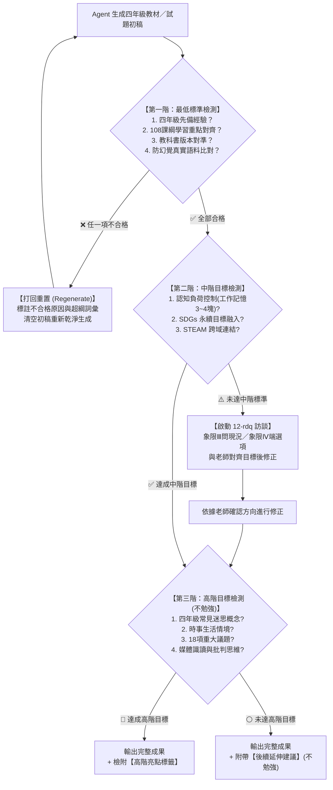

# 國小四年級教材與試題自我檢測審查機制 (G4-Review v2.1)

> **核心宗旨**：保障 AI 生成之國小四年級教材、試題、作業或學習單，具備真實教學現場之可用性、合規性與專業度。
> **處置準則**：
> 1. **未達最低標準** ➔ **立刻打回重置（自毀重產，禁止輸出半成品給教師）**。
> 2. **未達中階目標** ➔ **啟動 `12-rdq` 需求探索技能，端出選項向教師確認取捨後再修正**。
> 3. **未達高階目標** ➔ **不勉強，列為加分延伸或亮點標籤**。

---

## 核心基本設定與教科書版本鎖定

| 項目 | 預設規格與偏好 |
|---|---|
| **學校與年級** | 臺中市梧棲區中正國民小學（梧棲區中正國小）四年級 |
| **任教科目固定版本** | • **數學**：**南一版**（四上：一億以內的數、乘法、角度、除法、三角形、分數、小數、公里）<br>• **國語**：**翰林版**（四上：L1美麗島、L2請到我的家鄉來、L3鏡頭下的家鄉、L4飛行夢、L5月光下、L6又遠又近的月亮、統整活動一～四）<br>• **社會**：**康軒版**（四上：1-1家鄉在哪裡、1-2家鄉的地形、1-3氣候水資源與生活、傳統住屋、傳統信仰與老街、節慶與作息）<br>*(以上三科自動鎖定為預設版本，免每次重複詢問；其餘科目如自然、英語則依規確認)* |
| **中階未達標 RDQ 策略** | **極簡「一鍵選擇」模式（象限Ⅳ端菜單）**：<br>直接端出 2~3 個具體、立即可採納的教材/試題改造方案供老師快速勾選確認，嚴禁冗長發散詢問，將打擾降至最低。 |
| **輸出架構原則** | **同型態輸入即輸出原則（Format Parity）**：集中產出於 `reviewed/` 目錄，輸入 `.md` 出 `_優化版.md` 與 `_審查報告.md`；輸入 `.html` 出 `_優化版.html`；輸入 `.docx` 出標準考卷。 |

---

## ⚠️ 跨 Agent 規範與版權保護守則（重要提醒）

1. **嚴禁公開上傳教材原檔**：因版權保護限制，**公開儲存庫嚴禁 commit / push 任何出版社教科書、習作之 PDF/Zip 原檔**（由 `.gitignore` 強制隔離）。
2. **本機教材檢查提示**：其他 Agent 接手或執行審查前，必須先檢查工作區目錄下是否存在對應版本的課習教材資料夾（如 `115四上數課習/`、`115四上國課習/`、`115社會課習/`）。若偵測到缺失，必須明確提示使用者：「因版權限制，系統未附帶教科書原始檔案，請使用者先自行由校內合法教學資源庫下載所需版本的教科書/習作 PDF 放置於專案目錄後再行精確比對。」

---

## 審查流程漏斗圖（State Machine）



---

## 🛑 第一階：最低標準（Must-Have・一票否決門檻）

> **處置動作**：**若未達到任一指標，一律「打回重置（Regenerate）」，絕不將未達標內容呈現給教師。**

| 檢核維度 | 具體指標與評判基準 | 驗證方法與檢查點 |
|---|---|---|
| **1. 四年級先備經驗** | • 嚴格對準國小中年級（三下至四上）認知發展階段（皮亞傑具體運思期轉型期）。<br>• **不可超綱**：嚴禁出現未學過之五、六年級概念（如未知數方程式 $x/y$、複雜小數乘除、柱體錐體體積公式、負數、速率公式等）。<br>• 語文難度：國字注音對齊教育部四年級常用字彙，無生僻罕用字；閱讀理解篇幅控制在 400~600 字內。 | 檢查概念是否為一至三年級已奠基、四年級正建構之內容。凡超綱概念立刻攔截。 |
| **2. 108 課綱學習重點** | • 試題或教材必須清楚標註對應之 **學習表現** 代碼（如國語 `5-Ⅱ-1`、`6-Ⅱ-1`、數學 `n-Ⅱ-1`、`n-Ⅱ-7`、`s-Ⅱ-1`、社會 `社2a-Ⅱ-1`、`地1b-Ⅱ-1`）與 **學習內容** 代碼（如國語 `Ab-Ⅱ-1`、數學 `N-4-4`）。<br>• 核心素養導向：非死背死記，須包含生活情境脈絡化問題。 | 每道試題或教材單元，末端或後設資料必須具備精確的 108 課綱代碼對應。 |
| **3. 教科書版本對準** | • 必須明確對準該科目在該學期選用之教材版本（南一數、翰林國、康軒社）之單元編排順序與專有名詞。 | 驗證單元名稱、用詞是否吻合該版本進度。 |
| **4. 防幻覺真實語料比對（Anti-Hallucination）** | • **嚴禁憑空假審查**：審查命題字詞、生字、語詞時，嚴禁僅憑 AI 內建概略印象進行假審查！<br>• 必須透過 `scripts/check_curriculum.py` 實際讀取本機課習 PDF（或由 `.cache/textbook_corpus.json`）進行精確字串比對（Exact Substring Match）。<br>• 若試題或學習單中包含非本冊課文/習作之未學詞彙，必須精確標示出「未查得之超綱詞彙清單」，並**直接打回重置，禁止交付**。 | 執行 `python scripts/check_curriculum.py <檔案路徑>` 比對語料庫命中狀態。 |

---

## ⚠️ 第二階：中階目標（Should-Have・退回確認機制）

> **處置動作**：**若未達成本階任一指標，不可直接敷衍產出，必須立即啟動 `12-rdq` 技能進行訪談，端出具體選項向教師確認後始得修正。**

| 檢核維度 | 具體指標與評判基準 | RDQ 訪談規範 (Lite 模式 $\le 2$ 題) |
|---|---|---|
| **1. 認知負荷理論 (CLT)** | • **工作記憶容量控制**：四年級學童工作記憶容量約 3~4 個資訊塊（chunks）。題幹條件精簡，無干擾雜訊。<br>• **外在負荷最小化**：版面結構清晰、圖文相鄰（避免注意力分散效應 Split-Attention Effect）、無冗餘贅詞（避免冗贅效應 Redundancy Effect）。<br>• **相關負荷優化**：提供思考鷹架（步驟指引、解題線索提示框、填空圖表）。 | **象限Ⅲ（問現況）**：「請問班上學生的閱讀理解落差大嗎？題幹是否需要加上步驟化的鷹架提示？」<br>**象限Ⅳ（端菜單）**：「目前版面字數稍多，我提供『A. 精簡題幹並附思考指引框』或『B. 原文保留但加粗關鍵字』兩種排版，老師希望採用哪種？」 |
| **2. SDGs 永續目標融入** | • 將生活情境有機融入 17 項永續目標中的適合主題（如：SDG 3 健康、SDG 6 淨水、SDG 11 永續城鄉、SDG 12 責任消費、SDG 14 海洋生態、SDG 15 陸域生態）。<br>• 拒絕牽強附會：題目脈絡必須自然，而非生硬貼上標籤。 | **象限Ⅳ（端菜單）**：「本單元在數學統計圖表/國語閱讀中，建議可融入『SDG 12 減少校園午餐廚餘』或『SDG 14 梧棲港海洋塑膠廢棄物調查』作為題材，老師偏好哪一個？」 |
| **3. STEAM 跨域教學連結** | • 融入 Science（科學探究）、Technology（科技應用）、Engineering（動手機構/工程思維）、Art（視覺美感與表達）、Mathematics（數學分析）至少 2 種以上跨域元素。<br>• 具有動手實作、觀察驗證或跨學科綜合應用之設計。 | **象限Ⅳ（端菜單）**：「若加入 STEAM 元素，可設計『讓學生設計省水機關並計算水量』的加分挑戰題，是否需要為您加入？」 |

---

## 🌟 第三階：高階目標（Nice-to-Have・若是不行不勉強）

> **處置動作**：**盡可能評估融入，但若單元性質不適合或過度負擔，則「不勉強」，僅在檢測報告中附帶延伸建議，不阻擋出題與輸出。**

### 🏷️ 四年級典型迷思概念分類代碼庫 (Misconception Code Index)

| 領域 | 迷思代碼 | 迷思名稱 | 誘答設計指引 (選擇題選項設計) |
|---|---|---|---|
| **數學** | `M4-FRAC-01` | 分數加減分母連加 | 設計選項：分子相加、分母亦相加（如 $\frac{a}{c}+\frac{b}{c}=\frac{a+b}{2c}$） |
| **數學** | `M4-PLACE-01` | 大數進位位值混淆 | 設計選項：讀作萬時遺漏中間零，或千位進位時十萬位未進 |
| **數學** | `M4-GEOM-01` | 邊長影響角度迷思 | 設計邊長較長但角度較小的圖形選項 |
| **數學** | `M4-GEOM-02` | 量角器內外圈讀反 | 設計與 180 度補角相關的錯誤刻度選項 |
| **數學** | `M4-CALC-01` | 乘法補零對齊錯誤 | 直式乘法十位數乘積未向左縮一格 |
| **國語** | `C4-PUNCT-01` | 一逗到底與標點誤用 | 辨析句號、分號、冒號與引號之使用情境 |
| **國語** | `C4-TEXT-01` | 敘事缺乏五感與層次 | 學習單提供「視覺/聽覺/嗅覺」鷹架提示防止流水帳 |
| **國語** | `C4-STRUC-01` | 段落主旨不明結構鬆散 | 填空引導起承轉合四段結構 |
| **社會** | `S4-MAP-01` | 地圖指北標與方位混淆 | 設計上北下南右東左西之反轉干擾情境 |
| **社會** | `S4-LOCAL-01` | 海線環境與生活誤解 | 結合九降風、風力發電與防風林功能之典型混淆選項 |
| **社會** | `S4-GEO-01` | 地形特徵與生活型態混淆 | 誤認平原只能種田、盆地易積水等絕對因果概念 |

---

## 🔄 同型態輸入即輸出原則 (Format Parity Principle)

1. **Markdown 輸入 (`.md`)**：
   - 輸出至 `reviewed/[原檔名]_優化版.md`
   - 文末直接附加標準化 Markdown 格式的「AI 自我檢測審查報告」。
2. **HTML 網頁輸入 (`.html`)**：
   - 輸出至 `reviewed/[原檔名]_優化版.html`
   - 在網頁底部或右上方插入互動式審查檢測報告折疊面板（含第一/二/三階檢視與 Before/After 比對切換）。
3. **Word 講義/考卷 (`.docx` / 考卷文件)**：
   - 遵照 Windows 教學處相容排版（10.5pt、單行間距、正黑體/標楷體、雙欄防跑版）。
   - 在 `reviewed/` 輸出優化後檔案，並隨附 `reviewed/[原檔名]_審查報告.md`。

---

## 執行自我檢測之標準輸出模板（Self-Review Report）

```markdown
### 📋 國小四年級教材／試題自我檢測審查報告

#### 🛑 第一階：最低標準審查（合格方得輸出）
- [x] **四年級先備經驗**：PASS（無超綱符號與概念，詞彙對準中年級常態）。
- [x] **108課綱學習重點**：PASS（對應代碼：[填入學習表現代碼]、[填入學習內容代碼]）。
- [x] **教科書版本對準**：PASS（版本：[例如：康軒四上第X單元]，確認機制：[查中正國小版本／向老師確認]）。
- [x] **防幻覺真實語料比對**：PASS（真實語料命中率：20/20，無未學生僻詞彙）。

#### ⚠️ 第二階：中階目標審查（未達則啟動 RDQ 訪談）
- [x] **認知負荷理論 (CLT)**：達成（資訊分塊 3 塊內，附解題鷹架步驟，無干擾圖文）。
- [x] **SDGs 永續目標**：達成（融入 SDG [編號與名稱]）。
- [x] **STEAM 跨域教學**：達成（結合 [例如：S科學探究 + M數學統計]）。
*(若未達成，標記：未達標，已自動發起 RDQ 需求釐清問句)*

#### 🌟 第三階：高階目標加分項（不勉強）
- [x] **四年級常見迷思診斷**：已融入（迷思代碼：[例如：M4-FRAC-01]，說明迷思點與誘答設計）。
- [x] **時事與在地生活情境**：已融入（融入臺中港區/高美濕地/九降風）。
- [x] **18項議題融入**：已融入（[例如：環境教育/海洋教育]）。
- [x] **媒體識讀能力**：已融入（辨識事實 vs 觀點）。
```

---

## 自動化檢核工具調用方式

本技能自帶自動化三階檢核工具：
```bash
python scripts/check_curriculum.py <檔案路徑>
```
腳本將自動讀取語料庫快取 `.cache/textbook_corpus.json`，進行字串比對，並在 `reviewed/` 目錄集中輸出優化版與審查報告。
